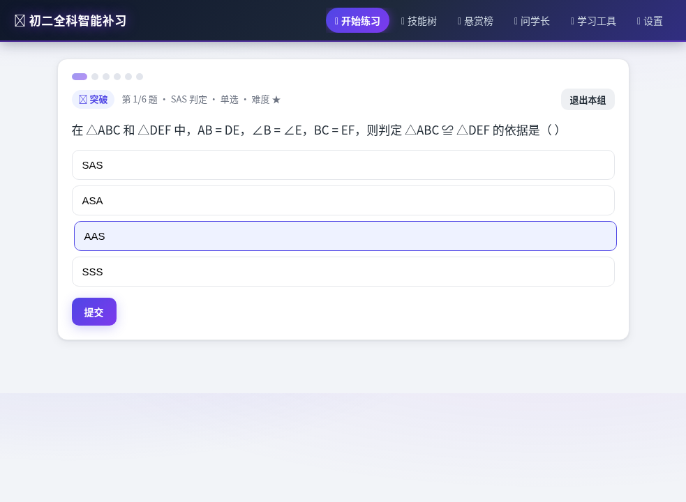
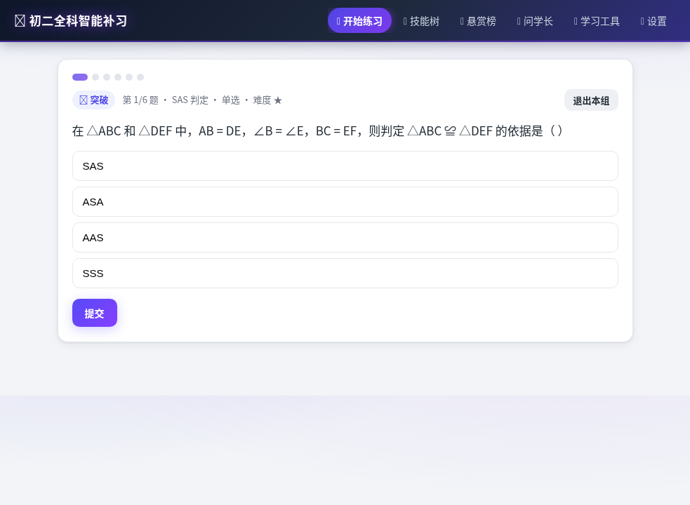
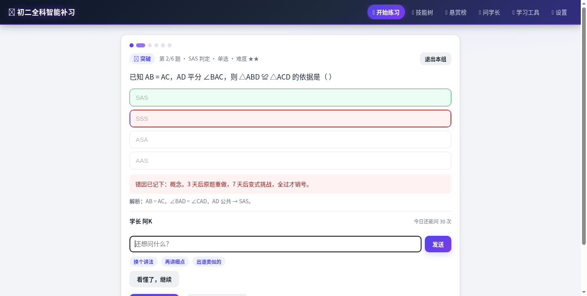
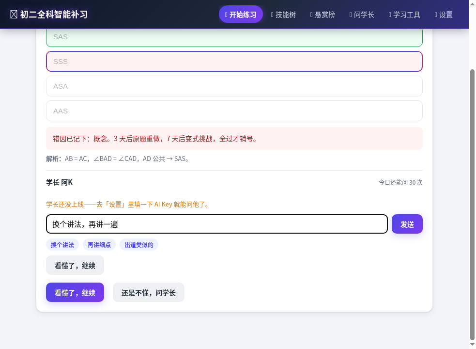
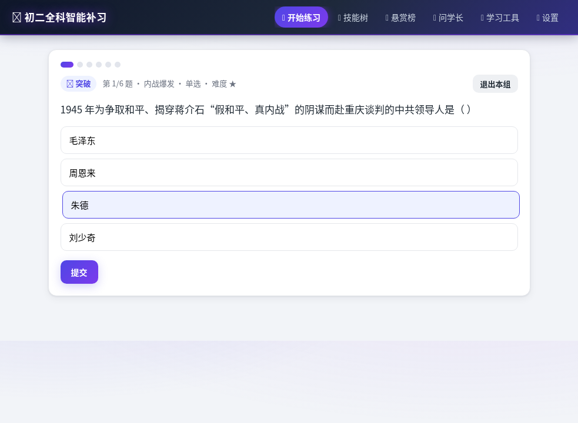
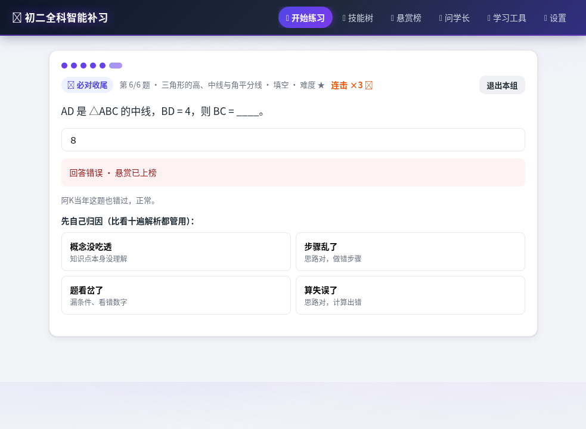
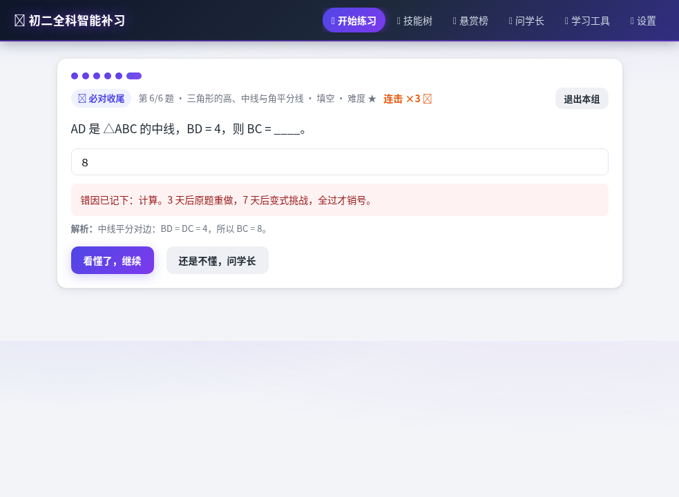
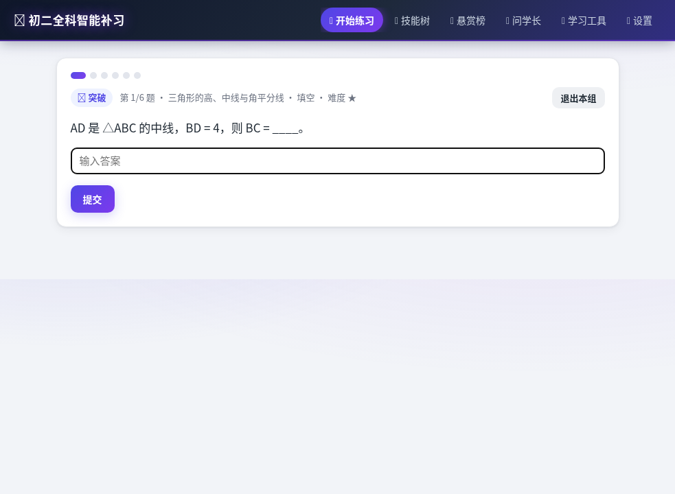
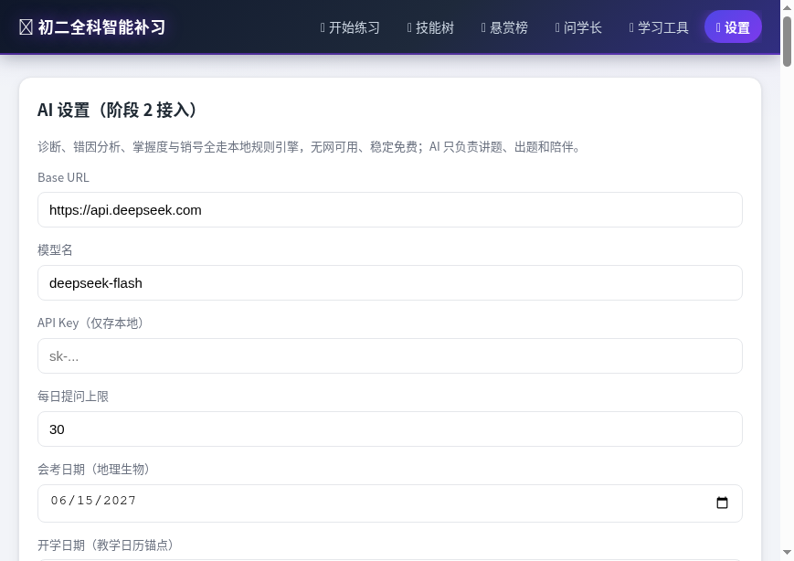

# Dogfood Report: 初二全科智能补习

| Field | Value |
|-------|-------|
| **Date** | 2026-09-17 |
| **App URL** | http://127.0.0.1:8080/ |
| **Session** | 127-0-0-1-8080 |
| **Scope** | 全站（学生使用视角）：选科/选范围→开练→作答→判分→错题跟进→AI 学长→技能树/悬赏榜/学习工具/设置/小游戏，含边界与异常 |

## Summary

| Severity | Count |
|----------|-------|
| Critical | 0 |
| High | 4 |
| Medium | 10 |
| Low | 2 |
| **Total** | **16** |

> 注：ISSUE-001 ~ 006 为首轮全站实测发现；ISSUE-007 / 008 为修复回归复核（二轮巡检）中顺带发现；ISSUE-009 为三轮核心链路（错题闭环）实测发现；ISSUE-010 / 011 为四轮「学习数据一致性巡检」（战报聚合 / 赛季结算）实测发现；ISSUE-012 / 013 / 014 为五轮「题库管理 / 设置页（含危险操作）」实测发现；ISSUE-015 为六轮「AI 周报 / 月报与长页面导航」实测发现；ISSUE-016 为七轮「设置页文案」实测发现（学生可见标题混入内部开发阶段术语）。全部均为真实问题，发现后即时修复并实测闭环。全部 16 项当前均已修复并通过单测（263 pass / 0 fail）与浏览器实测。

## Issues

<!-- Copy this block for each issue found. Interactive issues need video + step-by-step screenshots. Static issues (typos, visual glitches) only need a single screenshot -- set Repro Video to N/A. -->

### ISSUE-001: 会考倒计时横幅文字对比度极低，几乎不可读

| Field | Value |
|-------|-------|
| **Severity** | high |
| **Category** | accessibility / visual |
| **URL** | http://127.0.0.1:8080/ （首页底部） |
| **Repro Video** | N/A（静态样式问题） |

**Description**

首页底部 `⏳ 生地会考还有 272 天` 横幅使用浅蓝文字 `rgb(186, 230, 253)` 叠在浅蓝背景 `rgba(56, 189, 248, 0.14)` 上，实测原始对比度约 **1.1 : 1**，远低于 WCAG AA 要求的 4.5 : 1。会考倒计时是学生每天最关心的关键信息（驱动紧迫感、安排复习），却几乎看不清。期望：提高文字/背景对比度（如深色文字或加深背景）。

**Repro Steps**

1. 打开首页 http://127.0.0.1:8080/
   

2. 滚动到页面底部「放松小游戏」下方的会考倒计时横幅

3. **观察：** 文字与背景同为浅蓝色系，几乎融在一起，难以辨认
   

---

### ISSUE-002: 主答题流未选择答案直接点「提交」无任何反馈

| Field | Value |
|-------|-------|
| **Severity** | medium |
| **Category** | ux / functional |
| **URL** | http://127.0.0.1:8080/ （练习答题页） |
| **Repro Video** | N/A（两张静态截图对比：点击前后页面完全一致） |

**Description**

主答题流中，若学生未选择任何选项就点「提交」，页面**没有任何反应**——无校验提示、无按钮禁用态、无抖动/高亮。学生容易以为系统卡住而反复点击或误以为已提交。对照证据：同一应用内「90 秒微课」自测的「确认」按钮初始即为 **disabled**（未作答不可提交），说明主答题流缺少这层一致性保护。期望：未作答时禁用「提交」或给出「请先选择答案」的即时提示。

**Repro Steps**

1. 首页选择科目后点击「开练（当前科目）」，进入第 1/6 题
   

2. 不选择任何选项，直接点击「提交」按钮

3. **观察：** 页面完全不变——仍是同一道题、选项未选、无任何提示
   

---

### ISSUE-003: 学长面板同时出现两个「看懂了，继续」按钮

| Field | Value |
|-------|-------|
| **Severity** | medium |
| **Category** | functional / ux |
| **URL** | http://127.0.0.1:8080/ （答题后错题反馈 → 问学长面板） |
| **Repro Video** | N/A（静态截图） |

**Description**

答错后从反馈区点击「还是不懂，问学长」打开学长面板，面板与页面底部**同时渲染出两个「看懂了，继续」按钮**（一个灰色、一个紫色），文案完全相同但样式/层级来源不同。学生不知该点哪一个，容易点错或产生困惑。期望：面板打开时只保留一个主行动按钮。

**Repro Steps**

1. 进入练习并答错一题，出现错题反馈区

2. 点击「还是不懂，问学长」，打开学长面板
   

3. **观察：** 页面中出现两个「看懂了，继续」按钮（一个灰色、一个紫色）
   

---

### ISSUE-004: 题量不足的知识点无 AI Key 时静默缩水，题头仍承诺「第 N/6 题」

| Field | Value |
|-------|-------|
| **Severity** | medium |
| **Category** | ux / functional |
| **URL** | http://127.0.0.1:8080/ （练习答题页，选范围：历史·八上 → 第五单元 解放战争 → 内战爆发） |
| **Repro Video** | N/A（两张静态截图对比：题头承诺 1/6，实际 2 题后即结算） |

**Description**

题组被硬编码为 **6 个槽位**（热身 → 突破 → 交错 → 收尾必对题），但只要所选范围内的可用题量不足 6 题，系统就**静默缩水**：题头仍固定显示 `第 N/6 题`，中间空槽被跳过导致**题号跳号**（实测出现 `第 3/6 题` 直接跳到 `第 6/6 题`），整组提前结算。虽然「出题范围」处有一行小字说明「范围内题不够一组（6 题）时，学长会按真题风格现场补几道（需 AI Key）」，但**进入答题后组内再无任何提示**——题头仍固定 `/6`、题号跳号、提前结束也不解释原因。

学生视角的三重困惑：
1. **承诺落空**——开练前文案写「今天一组 6 题」，题头写 `N/6`，实际只发 2 或 4 题；
2. **题号不自洽**——同一薄节两次复现分别是 `1/6 → 2/6 → 结算` 与 `1/6 → 6/6 → 结算`，学生会以为题目加载失败或系统出 bug；
3. **组内无解释**——唯一线索只是选范围处一行易被忽略的小字，进入答题后提前结束无任何说明（实际只需配置 AI Key 就能补足）。

值得注意的是，系统在「跟进题」入口（无 Key 时）会明确提示「学长还没上线——去『设置』里填一下 AI Key 就能问他了」（`screenshots/issue-004-nokey-followup.png`），说明产品本身具备这种解释能力，只是**答题主流程这条路径上漏了**。期望：题量不足时题头按实际题量显示（如 `第 1/4 题`），或在题组开始/结束时明确提示「该范围仅有 N 题，配置 AI 学长可现场补足 6 题」。

**Repro Steps（案例 A：历史·八上·内战爆发，题池 2 题）**

1. 首页选择「历史」→「历史·八上（中国近代史）」→「第五单元 解放战争」→「内战爆发」→ 点击开练

2. **观察：** 题头显示 `第 1/6 题 · 内战爆发 · 单选 · 难度 ★`，承诺一组 6 题
   

3. 依次作答（第 1 题单选、第 2 题判断），点击第 2 题的「下一题」

4. **观察：** 未到第 6 题，直接跳到结算页，本组仅服务 2 题
   
   

5. 复核 `localStorage` 中 `tutor.attempts`：本组仅新增 2 条历史记录（`his8a-p16-q1Y`、`his8a-p16-q2Y`）；复核 `tutor.questions`：`his8a-p16` 题池仅 `q1 single` + `q2 judge` 两题。二者印证题头 `/6` 的承诺落空。

**Repro Steps（案例 B：数学·八上·与三角形有关的线段，题池 4 题 —— 题号跳号）**

1. 首页选择「数学」→「数学·八上」→「第11章 三角形」→「与三角形有关的线段」→ 点击开练

2. 前 3 题题头依次为 `第 1/6 题`、`第 2/6 题`、`第 3/6 题`（单选）

3. **观察：** 第 4 题（本组最后一题，填空题）题头**直接跳变为 `第 6/6 题`**，跳过 4/6、5/6
   

4. 作答后进入结算页，底部 toast **明确写着「这组 4 题练完了」**
   

5. 复核 `tutor.questions`：`与三角形有关的线段`（`m8a-c11-s1`）全部可出题仅 4 道（`m8a-p1` 单选×2、`m8a-p2` 单选×1 + 填空×1），与 toast 的「4 题」一致——即系统知道真实题量是 4，却仍在题头显示 `/6`。

6. **修复后复核（浏览器实测）：** 按案例 A 重走「历史 → 历史·八上 → 第五单元 解放战争 → 内战爆发 → 开练」，题头正确显示 `第 1/2 题 · 内战爆发 · 单选 · 难度 ★`，进度点由 6 个减为 **2 个**；第 2 题为 `第 2/2 题 · 判断`，**全程无跳号**；整组结束的结算页显式说明「本组共 2 题（该范围能出的题有限）。想练满 6 题，可在「设置」里配置 AI 学长现场补题。」，底部 toast 同步为「这组 2 题练完了」（验证通过）。另注：「专项练」（学习页/结算页「一键开练」）走的是 `planFocusSession`，单点题不足时会用**同科高优先级知识点交错补足**到 6 题，故该路径题头仍为 `N/6` 且实际确有 6 题，不属本缺陷范围。

---

### ISSUE-005: 填空题答案判分不做等价归一，全角数字被判错

| Field | Value |
|-------|-------|
| **Severity** | high |
| **Category** | functional / correctness |
| **URL** | http://127.0.0.1:8080/ （练习答题页，数学·八上 → 第11章 三角形 → 与三角形有关的线段 → 填空题） |
| **Repro Video** | N/A（静态截图对比 + `localStorage` 记录） |

**Description**

填空题判分采用**逐字符严格比对**，不做任何等价归一（全角/半角、前后空格、大小写、数学符号写法等）。学生用中文输入法作答时极易打出**全角数字**，此时即使答案在数学上完全正确也会被判错，并直接进入「答错 → 归因 → 上错题榜 → 3 天重做」的错误闭环。

实测：题目 `AD 是 △ABC 的中线，BD = 4，则 BC = ____。`（正确 `8`），学生输入全角 `８`，系统判定 **回答错误**，错题本记录 `myAnswer:"８"` vs `correctAnswer:"8"`。

这属于**最高优先级**的体验问题：学生会认为是「系统坏了」，并对自己本来掌握的知识点产生怀疑；同时产生一条虚假错题、虚增错题负担，直接打击「用最短时间提分」的目标。同类风险还存在于数学答案的**上标/分式**写法（题库中存在 `x⁸`、`(x+2)²`、`2x(2x-1)`、`a/(x+2)` 等答案，学生几乎不可能用键盘打出同样字形）。

期望：提交后先做归一化比较（全角转半角、去除首尾与内部多余空格、忽略大小写、数字/常用符号等价），任一形式命中即判对；若仍判错，反馈区应显式并列展示「你的作答 / 正确答案」，让差异一目了然。

**Repro Steps**

1. 首页选择「数学」→「数学·八上」→「第11章 三角形」→「与三角形有关的线段」→ 开练，一路答到最后的填空题 `AD 是 △ABC 的中线，BD = 4，则 BC = ____。`

2. 用中文输入法输入全角数字 `８`，点击「提交」

3. **观察：** 题面下方出现 `回答错误 · 悬赏已上榜`，并要求学生先做错因归因（`８` 与 `8` 本应等价）
   

4. 归因后反馈区只给出解析 `中线平分对边：BD = DC = 4，所以 BC = 8。`，**未并列显示「你的作答 vs 正确答案」**，难以让学生察觉是输入法全角问题
   

5. 复核 `localStorage` 中 `tutor.wrongbook` 最新一条：`{"questionId":"m8a-p2-q2","myAnswer":"８","correctAnswer":"8"}` —— 确认因全角/半角差异被记为错题。

---

### ISSUE-006: 练习中途刷新整组进度丢失，回到首页且无「继续上次练习」入口

| Field | Value |
|-------|-------|
| **Severity** | low |
| **Category** | ux / functional |
| **URL** | http://127.0.0.1:8080/ （练习答题页 → 刷新） |
| **Repro Video** | N/A（两张静态截图对比：答题中 → 刷新后回首页） |

**Description**

练习进行中若刷新页面（误触 F5、浏览器崩溃恢复、切后台被回收等），**当前题组进度会整组丢失**：页面直接回到首页的选科界面，没有任何「检测到未完成的练习，是否继续？」的提示。学生已作答题目对应的 `tutor.attempts` / `tutor.dayStats` 会保留（不会重复计分，也不会丢统计），但**本组「做到第几题」的会话状态没有持久化**——复核 `tutor.lessonState` / `tutor.planProgress` 中均无进行中题组的记录，说明会话仅存于内存。

对「碎片时间刷题」的学生（课间刷 2 题、被上课铃打断）而言，一次刷新就要从头再开一组，且重新开出的题目顺序/题面可能与上次不同（实测两次开练的第 1 题分别是单选与填空），体验上像「白做了」。期望：练习中保存会话进度，刷新后提示「继续上次练习 / 重新开始」。

**Repro Steps**

1. 首页选好范围后点「开练（当前科目）」，进入练习答题页（如 `第 1/6 题 · 填空`）
   

2. 在答题页直接刷新（F5 / 重新打开同一网址）

3. **观察：** 页面回到首页选科界面，选范围仍保留（说明设置持久化正常），但**没有任何「继续上次练习」入口，本组进度已丢失**
   

4. 复核 `localStorage`：`tutor.attempts` 已答记录的条数不变（不丢统计、不重复计分）；但 `tutor.lessonState` 仅存微课校验状态、`tutor.planProgress` 为空——**无任何进行中题组的会话记录**。

---

### ISSUE-007: 首页问候语与下方计划块矛盾——已完成的任务仍被喊「今天先办」

| Field | Value |
|-------|-------|
| **Severity** | medium |
| **Category** | ux / copy |
| **URL** | http://127.0.0.1:8080/ （首页 hero 问候语） |
| **Repro Video** | N/A（静态截图 + `localStorage` 记录） |

**Description**

首页 hero 问候语由 `Triggers.greeting(now)` 生成，内部用 `Scheduler.plan(now, 0)` 现算一份计划，**且完全不感知 `App.planDone`**；而下方计划块用的是 `Scheduler.plan(now, this.planSalt)` + `planDone`（已完成的块标 `✅ 已完成`）。两个数据源不一致，导致**同一屏内自相矛盾**：计划块明明已标「✅ 已完成」，问候语却仍写「今天先办 突破推进：生物」。

实测（当日计划两块均已完成）：问候语显示「今天先办 突破推进：生物」，而紧邻的两块均带「✅ 已完成」。学生刚做完却被系统催办，读起来像系统没记住自己的进度，削弱「系统在跟我的进度走」的信任感。

期望：问候语复用首页同一份计划数据，并过滤已完成科目；全部完成时改说「今天的计划已经清完，想加练就自己挑一科。」

**Repro Steps**

1. 完成当日首页「今日计划」中的全部任务块（两块均出现「✅ 已完成」）

2. **观察：** 顶部问候语仍写「今天先办 XXX」——与下方「✅ 已完成」矛盾（修复前）

3. 修复后复核：问候语变为「…今天的计划已经清完，想加练就自己挑一科。」，与两块「✅ 已完成」一致（验证通过）

---

### ISSUE-008: 首页「🔄 换个组合」按钮点了没反应，永远换不出新组合

| Field | Value |
|-------|-------|
| **Severity** | medium |
| **Category** | functional |
| **URL** | http://127.0.0.1:8080/ （首页「今日计划」下方） |
| **Repro Video** | N/A（点击前后 `App.planSalt` 与组合对比） |

**Description**

「🔄 换个组合」按钮的实现是 `this.planSalt += 1; this.renderPractice(el);`，期望用盐值换出另一组任务。但 `Scheduler.plan(now, salt)` 里盐值只参与 `((i + dayIdx) % subjects.length) * 0.01` 这一 **0.01 量级的 tiebreak**，而各科目之间的真实分差（`bounty×10` / `rusty×2` / `exam+3` / `teaching×2`）远大于 0.01，排序结果几乎不变——**按钮是个死按钮，点击后界面毫无变化**。

实测：`App.planSalt` 由 0 变 1（状态确实改了），但组合前后完全相同（`biology, geography` → `biology, geography`）。学生反复点击都换不出新题，会认为系统卡死。已有单测「换个组合（salt）能换出不同组合」因断言过弱（3 科取 2 有 3 种组合，只要求 `Set.size >= 2`）而**漏过了该缺陷**。

期望：盐值真正参与选科；`salt=0` 保持当天默认前 2，之后按盐值在排序结果上轮换起点，保证每次换批都真的换人。

**Repro Steps**

1. 打开首页，读取「今日计划」两块科目（修复前为 `biology, geography`）

2. 点击「🔄 换个组合」

3. **观察（修复前）：** 组合完全不变，但内部 `App.planSalt` 已 +1——按钮无效

4. 修复后复核：再次点击，组合由 `geography, history` 变为 `history, physics`（`planSalt` 1→2），确实换人（验证通过）

---

### ISSUE-009: 「变式待测」悬赏被静默跳过，记录永久卡死、承诺的 D7 变式永不出现

| Field | Value |
|-------|-------|
| **Severity** | high |
| **Category** | functional / correctness |
| **URL** | http://127.0.0.1:8080/ （练习答题页，错题闭环 D7 变式关） |
| **Repro Video** | N/A（`localStorage` 记录对比 + 关卡类型/徽章对比） |

**Description**

错题闭环承诺「D3 原题重做 → 通过后 D7 变式挑战 → 全过才销号」。但变式关的选题函数 `Wrongbook.variantQuestionFor` 只查**同知识点 + 同题型**的第二题；题库中大量考点每个只出一道题（或同节仅同型一题），此时该函数返回 `null`，而 `App.renderStage` 的兜底仅在**配置了 AI Key**时才会现场出题——本环境无 Key，于是 `Quiz.advance()` 把这一关**静默跳过**。

后果：学生重做通过后系统明确承诺「3 天后变式挑战——过了就销号领赏」，但到点后**变式关从未出现过**（徽章直接变成 `⚔️ 突破`、题面是另一道普通题），错题记录永远停在 `变式待测` 且 `variantAt` 已过期，**每天占据「今日悬赏」第一格却永远无法销号**——闭环断在最后一环，且系统对孩子做了无法兑现的承诺。

量化影响面：全库 **679 题中 429 题（63%）** 不存在同知识点同题型的第二题（分科：数学 95 / 物理 70 / 政治 60 / 生物 58 / 英语 52 / 历史 50 / 地理 30 / 语文 14），即**多数学考点一旦进入 D7 就会卡死**。进一步核对：这 429 道题**每一道都存在同知识点的其他题型可作兜底**（无兜底者 0 道，兜底覆盖率 100%），说明修复只需「放宽到同知识点任意题型」即可，无需依赖 AI。

期望：变式关在无同型第二题时，退回**同知识点任意题型**的题；仅当该考点真的只有一道题时才走 AI 现场出题；有 AI Key 的学生仍优先获得 AI 生成的同型真变式。

**Repro Steps**

1. 播种一条已到期的 `变式待测` 悬赏记录（原题 `m8a-p2-q2`，填空，知识点「三角形的高、中线与角平分线」，`variantAt` 设为过去时刻；本环境未配置 AI Key）

2. 进入练习开练

3. **观察（修复前）：** 第一关徽章显示 `⚔️ 突破`（而非承诺的 `🎯 变式挑战`），题面是另一道普通题；复核 `tutor.wrongbook`，该记录仍为 `变式待测`、`variantAt` 仍是过去时刻——**变式关被静默跳过，记录永久卡死**

4. **修复后复核：** 第一关徽章正确显示 `🎯 变式挑战`、题头 `第 1/6 题 · 三角形的高、中线与角平分线 · 单选`，题面为同知识点的兜底题 `m8a-p2-q1`（验证通过）

5. **修复后复核（销号闭环）：**
   - 答**对** → 记录变为 `已销号`（`closedAt` 落盘），反馈「🎯 悬赏销号！悬赏销号，赏金到账（来自错题本的敬意）。」（验证通过）
   - 答**错** → 记录变为 `顽固`，反馈「变式没过——这道题转入顽固清单。别硬刷，换个讲法重讲一遍再来。」并给出「回炉微课（换个讲法）」（验证通过）

**修复内容**（3 文件 + 2 条回归测试）

- `js/wrongbook.js`：`variantQuestionFor(record, allowAnyType)` 增加放宽带——同型第二题优先，缺失时退回**同知识点任意题型**（仅当显式传 `true` 时启用）。
- `js/quiz.js`：`questionFor` 的 `variant` 分支改用 `Wrongbook.variantQuestionFor(rec, true)`，保证变式关一定能出题、不再被跳过。
- `js/app.js`：`renderStage` 调整判定顺序——先判断「题库确无同型题 **且** 有 AI Key」才走现场 AI 出题，否则交给题库兜底，杜绝无 Key 时静默跳关。
- 回归测试：`tests/wrongbook.test.js`（同知识点无同型题时严格模式返回 null、兜底模式返回异型题；考点仅一题时连兜底也为 null）+ `tests/quiz.test.js`（变式关在同型题缺失时必须能出题）。全量单测 **233 pass / 0 fail**。

---

### ISSUE-010: 战报聚合「点亮技能点」恒为 0——读错了字段名

| Field | Value |
|-------|-------|
| **Severity** | medium |
| **Category** | functional / correctness |
| **URL** | http://127.0.0.1:8080/ （技能树 → 学期回望 / 月报） |
| **Repro Video** | N/A（`localStorage` 对比 + 页面数字对比） |

**Description**

日明细里「当日点亮技能点」的字段名是 **`litCount`**（`Store.dayStats['YYYY-MM-DD'] = { answered, correct, maxCombo, litCount, closures }`），但区间聚合函数 `Store.aggregateDayStats(startTs, endTs)` 在累加时读的是 **`st.lit`**（不存在的字段），恒取到 `undefined || 0 = 0`。`js/report.js` 的 `monthStats` 内联聚合也存在同一处读错。

后果：「学期回望」「月报」里最重要的两项**正向成就指标**——「本学期累计点亮 N 个」与「新点亮知识点 N 个」——在真实使用中**永远显示 0**，与该区间内逐日战报的 `💡 点亮知识点 N` 直接自相矛盾。学生辛苦点亮技能点，回头一看「本学期累计点亮 0」，既打击成就感又损害系统可信度。

> 说明：`seasonCardHTML` / `termReviewCardHTML` 的**同名字段自洽**，因此数字不会崩，只是「静默错为 0」——这类错误在页面上看不出「报错」，必须靠跨视图核对才能发现。

期望：聚合读 `st.litCount`，与日明细字段保持一致；并补一条跨视图一致性回归测试。

**Repro Steps**

1. 播种若干天 `dayStats`（含 `litCount`），并让这些日期落在本学期/本月区间内
2. 打开技能树 → 看「学期回望」的「本学期累计点亮 N」
3. **观察（修复前）：** N = 0，而逐日战报里明明写着「💡 点亮知识点 1」
4. **修复后复核：** 聚合值正确累计（如 1），与逐日战报一致

**修复内容**（1 文件 + 断言回归）

- `js/storage.js`：`aggregateDayStats` 内 `out.lit += st.litCount || 0`（原为 `st.lit`）。
- `js/report.js`：`monthStats` 内联聚合同步改读 `st.litCount`（L190）。
- 回归测试：`tests/scheduler.test.js` 新增赛季快照断言 `snap.lit === 1`，锁定「`litCount` → `lit`」的聚合链路。

---

### ISSUE-011: 进行中的赛季结算值永久冻结在首次（通常全 0）快照

| Field | Value |
|-------|-------|
| **Severity** | medium |
| **Category** | functional / correctness |
| **URL** | http://127.0.0.1:8080/ （技能树 → 赛季结算卡片） |
| **Repro Video** | N/A（`localStorage['tutor.seasons']` 对比 + 页面卡片对比） |

**Description**

赛季结算本应「进行中实时累计、赛季结束后冻结为结算值」。但 `Scheduler.recordSeason` 在写入前有一句短路：`if (seasons[s.key]) return seasons[s.key];`——**只要该赛季 key 已存在就立即返回旧快照，永不刷新**。

而 `Report.render` 末尾首次调用 `recordSeason` 的时机，往往发生在学生当天刚开始、`dayStats` 还没有数据时，于是快照被**钉死在全 0**；此后无论学生刷多少题，赛季卡都停在「答题 0 · 正确率 0%」。

后果：一整个学期里，最该激励人的「🏆 赛季结算」卡片**永远是一片 0**，与「学期回望」「今日战报」的现实进度严重割裂——学生只会觉得「这东西坏了」。

期望：**进行中的赛季**每次渲染按当前 `dayStats` 刷新累计值（保留首次记录时间戳 `at`）；**已结束的赛季**保持冻结不回改。同时卡片需区分「（进行中）」与「（已结算）」，让学生知道哪个赛季已盖棺、哪个还在累积。

**Repro Steps**

1. 打开应用，进入技能树 → 赛季结算卡（首次快照此时可能为全 0）
2. 正常练习若干题（`dayStats` 增长）
3. 重新进入技能树 → 赛季卡
4. **观察（修复前）：** 赛季卡仍是「答题 0 · 正确率 0%……」，与「今日战报」「学期回望」的进度不一致
5. **修复后复核：** 植入一条陈旧全 0 快照后刷新页面，赛季卡自动修正为真实值（答题 12 · 正确率 75% · 销号 2 · 点亮 3）**且首次时间戳 `at` 保留不变**；进入下一赛季后，旧赛季（如 2026-mid）结算值保持冻结，卡片同时显示「期中赛季（已结算）」与「期中赛季（进行中）」

**修复内容**（2 文件 + 3 条回归测试）

- `js/scheduler.js`：`recordSeason` 去掉短路——进行中赛季每帧按 `aggregateDayStats(start, min(now, 赛季末))` 刷新，`at` 沿用首次值；赛季结束后自然冻结。`seasonOf` 年份改取「学期起点」，避免 9 月开学跨到次年 1 月时被拆成两个赛季 key。
- `js/report.js`：`seasonCardHTML` 为当前赛季标注「（进行中）」、其余标注「（已结算）」。
- 回归测试：`tests/scheduler.test.js` 3 条——「数据不变时重复记录内容一致」+「进行中赛季随战报实时刷新（不再冻结在全 0）」+「赛季结束后旧赛季结算值冻结不回改」。全量单测 **235 pass / 0 fail**。

---

### ISSUE-012: 题库选项答案 radio 未分组，单选可同时勾多项 → 静默存错答案

| Field | Value |
|-------|-------|
| **Severity** | medium |
| **Category** | functional / correctness |
| **URL** | http://127.0.0.1:8080/ （设置 → 题库管理 → 新增/编辑单选题） |
| **Repro Video** | N/A（DOM 行为 + `localStorage` 记录对比） |

**Description**

题库管理里「选项与答案」的**单选**答案控件是一组 radio，但各选项的 radio **未按同一组命名**（组内相互独立、互不排斥），学生在编辑/新增单选题时可以**同时勾选多个「答案」**。而 `App.bankCollect` 对 `single` 题型的取值逻辑是「取第一个被勾选项」（`data.answer[0]`），于是——**只要有多个勾选，系统就静默把序号最小的那一项存成答案**，与学生的实际选择不符，且界面上没有任何提示。

真实后果：学生先把「选项1」勾成答案，改主意勾「选项3」时，两个仍同时保持勾选，保存后落库的正确答案是「选项1」。直到用这道自建题开练、被系统按错误答案判分，才会发现异常——而这时已产生一条虚假错题。这属于「输入控件没有互斥 → 数据静默错位」类缺陷，页面不报错，必须靠行为对比才能发现。

> 与 ISSUE-005（填空判分）叠加时更糟：一处把错答判成对、一处把对答判成错，都会污染错题本与掌握度。

期望：单选答案的 radio 归为同一组（互斥），多选答案仍用 checkbox（可多勾），二者语义清晰、所见即所得。

**Repro Steps**

1. 设置 → 题库管理 → 选任一科目 → 点「+ 新增题目」（题型默认「单选」，4 个选项）
2. 勾选「选项1」右侧的「答案」，再勾选「选项3」右侧的「答案」
3. **观察（修复前）：** 两个「答案」radio 同时保持勾选
4. 保存后用该题开练：系统认定的正确答案是**选项1**（学生本意是选项3）
5. **修复后复核：** 勾「选项3」会自动取消「选项1」，保存的答案等于学生实际勾选项（验证通过）

**修复内容**

- `js/app.js`：选项答案 radio 统一 `name="bank-opt-ans"`（同组互斥）；多选仍为独立 checkbox。

---

### ISSUE-013: 「重置所有数据」不彻底——校准分 / 学习事实 / 计划 / 赛季等键残留

| Field | Value |
|-------|-------|
| **Severity** | medium |
| **Category** | functional / data-consistency |
| **URL** | http://127.0.0.1:8080/ （设置 → 重置数据） |
| **Repro Video** | N/A（`localStorage` 键集合对比） |

**Description**

设置页「重置数据」（文案承诺「重置所有数据」）调用 `Store.reset(SEED)`。但旧实现只重建 `init()` 会写的 11 个枚举键（`subjects / knowledgePoints / questions / lessons / attempts / mastery / wrongbook / lessonState / dayStats / settings / seedVersion`），**没有清理运行期写入的其他 `tutor.*` 键**。实测重置后仍残留：

- `tutor.activeSubjectId`（当前选科）
- `tutor.examScores`（大考校准录入的实考分）
- `tutor.facts`（学习事实/冷知识已读记录）
- `tutor.planProgress`（今日计划完成进度）
- `tutor.seasons`（赛季结算快照）

后果：学生点「重置所有数据」以为是干净重来，实际**大考校准分、学习事实、计划进度、赛季结算仍在**，与「重置」承诺不符；其中 `examScores` / `seasons` 会直接影响校准基线与赛季卡展示，使「重置后」的状态与「全新用户」不一致——属于「诚实性」层面的静默残留。

期望：`重置数据` 真正回到「全新用户」状态——清空本应用写入的**全部** `tutor.*` 键后再重建种子数据；非本应用的 localStorage 键不得触碰。

**Repro Steps**

1. 正常使用产生数据：录一次大考校准（写 `tutor.examScores`）、浏览产生 `tutor.facts`、完成今日计划（写 `tutor.planProgress`）、进入技能树触发赛季快照（写 `tutor.seasons`）
2. 复核 `localStorage`：可见上述 5 个键
3. 设置 → 重置数据 → 确认
4. **观察（修复前）：** 上述 5 个键**全部仍在**（仅枚举的 11 个键被清）
5. **修复后复核：** 仅保留 11 个重建键，其余 `tutor.*` 全部清除；非本应用键（如 `other.app`）不受影响（验证通过）

**修复内容**（1 文件 + 1 条回归测试）

- `js/storage.js`：`reset()` 改为先遍历 `localStorage` 清掉**所有** `tutor.` 前缀键，再 `_write('seedVersion', 0)` + `init(seed)` 重建，杜绝残留。
- 回归测试：`tests/scheduler.test.js` 新增「`Store.reset` 清空全部 `tutor.*` 键（含阶段3键），非本应用键保留」——断言重置后仅剩 11 个重建键、`other.app` 原样保留、`activeSubjectId` / `examScores` 已清空。

---

### ISSUE-014: 大考校准空输入被当 0 分，静默把整科掌握度下调（最多 −15）

| Field | Value |
|-------|-------|
| **Severity** | high |
| **Category** | functional / correctness |
| **URL** | http://127.0.0.1:8080/ （设置 → 考试模式 → 大考校准） |
| **Repro Video** | N/A（`localStorage` 掌握度 / examScores 对比） |

**Description**

「大考校准」的设计是：录入该科实考分后，按 `(实考分 − 当前该科均分) × 0.3` 双向微调该科**全部** L4 知识点掌握度（±15 封顶），并把实考分写入 `examScores`。但旧实现的首行是 `Math.round(Number(score) || 0)`——当输入框为**空串**时 `Number('') = 0`、`0 || 0 = 0`，于是**空输入被当作 0 分**，随后按「(0 − 均分) × 0.3」把该科所有知识点掌握度**向下调低（最多 −15）**，并把 `examScores[科] = 0` 落盘，整个过程还弹出「校准完成」的成功提示。

后果：学生在考试模式下**误点一次「校准」而没输入分数**，整科掌握度就被静默拉低、随之改变后续的错题/复习排程与选题权重——这是会伤害核心学习数据、又极难察觉的缺陷（相比 ISSUE-010/011 的「显示失真」，这条是**真的改了数据**）。

> 同类边界一并覆盖：`'   '`（纯空格）、`'abc'`（非数字 → `NaN || 0 = 0`）、`null` / `undefined` / `NaN` 都会走同一条「当 0 分」路径；负数 / 超过 100 也应拒绝而非照单全收。

期望：输入非法时**拒绝执行并提示**（如「请输入 0~100 的成绩」），不动掌握度、不写 `examScores`。

**Repro Steps**

1. 设置 → 打开「考试模式」（各科出现「实考分」输入框 + 「校准」按钮）
2. 不填分数，直接点某科「校准」
3. **观察（修复前）：** 弹出「校准完成：该科各知识点掌握度 −15（原均分 X → 实考 0）。」；复核 `tutor.mastery` 该科全部 L4 点分数 −15、`tutor.examScores[科] = 0`
4. **修复后复核：** 弹出「请输入 0~100 的成绩」；复核掌握度与 `tutor.examScores` **均未变化**（验证通过）

**修复内容**（2 文件 + 1 条回归测试）

- `js/scheduler.js`：`calibrate()` 首行加校验 `const raw = String(score == null ? '' : score).trim(); const n = Number(raw); if (raw === '' || !(n >= 0 && n <= 100)) return { ok:false, error:'请输入 0~100 的成绩' };`——把「空串/非数字/越界」统一挡在调度层（单一真相源，便于无 DOM 单测覆盖）。
- `js/app.js`：校准点击处理器删除行内重复校验，改为 `const res = Scheduler.calibrate(...); if (!res.ok) { alert(res.error); return; }`，成功提示复用 `res.delta / res.avg / res.score`。
- 回归测试：`tests/scheduler.test.js` 新增「空输入/非数字被拒，不动掌握度、不写 `examScores`」——覆盖 `'', '   ', 'abc', '-1', '101', null, undefined, NaN`，断言全部 `ok:false`、错误文案一致、`mastery.g1.score` 保持 50、`examScores` 仍为 `{}`。
- 附：`tests/scheduler.test.js` 的 localStorage mock 补齐 `key(i)` / `get length`，使 `Store.reset` 的「按前缀清键」路径可被真实验证（原 mock 缺此二者会让清理退化为空操作）。

---

### ISSUE-015: 技能树长页面（≈42 屏）无任何跳转/锚点，「月度复盘」入口被埋在页面最底部

| Field | Value |
|-------|-------|
| **Severity** | medium |
| **Category** | usability / navigation |
| **URL** | http://127.0.0.1:8080/ （技能树） |
| **Repro Video** | N/A（页面高度 / 元素坐标数值对比 + 截图） |

**Description**

技能树是「回看掌握度、发现薄弱点、进入复盘」的主入口，但在有真实学习数据的档案下，它已经长成**一个约 42 屏的长页面**：实测 `document.documentElement.scrollHeight ≈ 26,043px`、`window.innerHeight = 614px`，页面内含 **336 个技能节点 / 80 个章节卡 / 96 个区块**。而整个页面**没有任何科目跳转条、没有锚点 id、没有折叠机制**，唯一手段是手动滚动。

这带来两个直接后果：

1. **想复习某一科，要先滚过前面所有科目**。例如想找「物理」，其分组卡位于页面中段（实测第 10,770px 附近），每次进入都要盲滚十几屏才能定位，长页面把「查找」变成了「体力活」。
2. **「📊 月度复盘（AI 蒸馏档案）」入口几乎不可被发现**。该按钮位于 `#term-review-card`（学期回望卡）内，实测文档坐标 `top ≈ 25,906`，即**页面最底部**；学生不滚到底绝无可能看到——这等于把「学期回望 + 月度 AI 复盘」这类高价值复盘能力藏了起来，直接违背「最短时间提分」的目标。

**Repro Steps**

1. 用含真实学习数据的档案打开「技能树」
2. 测量页面规模与入口位置：`document.documentElement.scrollHeight ≈ 26,043`、`window.innerHeight = 614`（≈ 42 屏）；`document.getElementById('monthly-review-btn')` 的文档坐标 `top ≈ 25,906`
3. **观察（修复前）：** 页面**无** `.subject-jump-bar`、各 `subject-head` **无** `id`，只能手动滚动；月度复盘入口需滚到页面尽头才可见
4. **修复后复核（浏览器实测通过）：**
   - 页面顶部出现 sticky 跳转条，含 8 个科目按钮 + `📖 学期回望` 共 **9 个**，且 9 个目标锚点 `#subj-*` / `#term-review-card` **全部存在**
   - 点击「语文」→ `scrollY` 0 → **4,868**，`#subj-chinese` 落于视口 `top = 118px`（恰在 sticky 栏下方，**无遮挡**）
   - 切到「开始练习」再返回技能树后，跳转绑定**仍有效**（点击「物理」→ `scrollY = 10,770`，目标落于视口 `top = 129px`）
   - 点击「📖 学期回望」→ 直达页面底部，`#monthly-review-btn` 落入视口（`top = 477`，viewport 614）**可见可点**；跳转条 `position: sticky`、稳定停在 `top = 60px`（topbar 正下方，高度 48px）
   - 控制台**零报错**

**修复内容**（3 文件 + 1 条回归测试）

- `js/report.js`：`render()` 在 `#weekly-ai-slot` 之后插入 `.subject-jump-bar`（按 `chapters` 去重生成各科目按钮，并追加一个「📖 学期回望」按钮）；给每个 `subject-head` 加 `id="subj-<subjectId>"`；给 `termReviewCardHTML` 根节点加 `id="term-review-card"`；渲染末尾绑定 `.subject-jump` → `scrollIntoView({ behavior:'smooth', block:'start' })`。
- `css/app.css`：新增 `.subject-jump-bar`（`position: sticky; top: 60px`，移动端 `top: 56px`；半透明白底 + `backdrop-filter`；胶囊按钮 `.subject-jump`）；新增 `.subject-head, #term-review-card { scroll-margin-top: 118px; }`——避免锚点跳到 sticky 层（topbar 60px + 跳转条 48px）下面被遮挡。
- `tests/report.test.js`：新增「render：长页面提供科目跳转条与锚点（含学期回望入口）」——断言跳转条渲染、每个有章节的科目各有一个 `data-jump="subj-*"` 且对应 `id` 存在、`term-review-card` 锚点与跳转按钮成对存在（锁死「入口不被埋回页底」）。

---

### ISSUE-016: 设置页分区标题混入内部开发阶段术语

| Field | Value |
|-------|-------|
| **Severity** | low |
| **Category** | content / copy |
| **URL** | http://127.0.0.1:8080/ （设置） |
| **Repro Video** | N/A（静态文案） |

**Description**

设置页的两个分区标题把**仅供内部开发使用的阶段编号**直接写进了学生可见的 `<h2>`：`AI 设置（阶段 2 接入）`、`🏃 考试模式 & 大考校准（阶段 3）`。这些编号对应项目内部的迭代阶段划分，对使用者没有任何意义，还容易让第一次打开设置的学生误以为「AI 功能还没做完 / 设置还没上线」，白白折损信任感。



**Repro Steps**

1. 打开 http://127.0.0.1:8080/ → 顶部进入「设置」
2. **观察（修复前）：** 两个分区标题分别为「AI 设置（阶段 2 接入）」「🏃 考试模式 & 大考校准（阶段 3）」
3. **修复后复核：** 标题变为「AI 设置」「🏃 考试模式 & 大考校准」；页面其余字段（Base URL / 模型名 / API Key / 每日提问上限 / 会考日期 / 开学日期 / 考试模式科目 / 大考校准 / 数据备份 / 危险区）与交互均不变

**修复内容**

- `js/app.js` `renderSettings()`：两处分区 `<h2>` 去掉内部阶段括号——`<h2>AI 设置（阶段 2 接入）</h2>` → `<h2>AI 设置</h2>`、`<h2>🏃 考试模式 & 大考校准（阶段 3）</h2>` → `<h2>🏃 考试模式 & 大考校准</h2>`。纯文案改动、无逻辑变更；确认无测试断言该标题文案，改后全量单测仍 **263 pass / 0 fail**，并已核对服务端实际下发的 `js/app.js` 中不再出现这两处「（阶段 …）」标题。

---

## 好用之处（建议保留并放大）

以下是本次实测中确认「真的能帮学生省时间 / 提信心」的设计，建议在后续迭代中保护不被破坏：

1. **选科 → 选范围三级下钻，且即时生效**：科目 →「学到哪本」→「学到哪单元」→「学到哪节」，每一级选择都会实时刷新「出题范围」文本，学生心里有数；范围在刷新后仍保留（`tutor.unitScope`），不用每次重选。
2. **错题闭环设计扎实**：答错后**先让学生自己归因**（概念没吃透 / 步骤乱了 / 题看岔了 / 算失误了），再给解析；并明确承诺「3 天后原题重做、7 天后变式挑战、全过才销号」。这套「不抄答案、学完才销号」的机制，是直接针对「最短时间提分」的强设计。
3. **即时且具体的判分反馈**：判对时给出 `S 级`、掌握度变化（如 `75 → 90（+15）`）、连击数、**实际用时 vs 标准时长**（`用时 6s（标准 50s）`）与一句正向评语，反馈颗粒度足以让学生判断「我是真懂还是蒙对」。
4. **正向激励与即时满足**：掌握度分档（S/A/B）、连击 🔥、结算页「今日战报」（答题数 / 正确率 / 最高连击 / 新点亮技能点）、偶发「💠 冷知识卡」（如「负数概念中国《九章算术》比欧洲早一千多年」），对初中生的持续动机很友好。
5. **90 秒微课 + 自测**：微课自测的「确认」按钮初始即为 disabled（未作答不可提交），与主答题流形成了一致性对照。
6. **无 AI Key 时的优雅降级**：跟进题入口在无 Key 时明确提示「学长还没上线——去『设置』里填一下 AI Key 就能问他了」，不崩溃、不静默失败，且给出了下一步操作。
7. **小游戏与学习数据回流**：闪电心算回流计算掌握度、单词快闪答错的词自动进复习队列——娱乐与复习不是两张皮。
8. **重复提交已做防护（实测通过）**：单次「提交」后选项立即 disabled、按钮变为「下一题」，实测 `tutor.attempts` 仅 +1、`dayStats.answered` 仅 +1，**未出现重复计分**。
9. **无空状态崩溃**：实测 205 个「节」中没有任何一节是 0 题（最薄的节也有 2 题），8 个科目题量在 60–135 之间，不存在「选了范围结果一题都出不来」的崩溃路径。
10. **AI 周报 / 月报的「降级 + 生成 + 落库」三段都扎实（六轮实测通过）**：无 Key 时给的是**准确且可执行**的降级文案（而非报错）；有 Key（桩 `fetch`）时生成评语并写入《理解档案》（`learnerProfile`）**持久化**，视图切换后结果区清空但档案留存；六类错误（`badKey` / 空正文 / `finish_reason='length'` / 网络异常 / 非 JSON 正文 / 正文非 JSON）**全部映射正确**，额度耗尽提示准确、额度计数与调用次数一比一吻合。
11. **家长挑战（周末彩蛋）闭环完整（七轮实测通过）**：入口仅周末出现、工作日不显示（符合「周末彩蛋」设计）；用真实判分走完 3 题后进入结算页「儿子判赢 2 局 · 爸爸赢 1 局」，并落库 `tutor.parentChallenge`（实测 `{"total":3,"childWins":2,"parentWins":1,"win":true}`，`win === (childWins >= parentWins)` 成立），「裁判不偏袒，赢就是赢」的表达也很对味。
12. **主动触发器的「防骚扰红线」逐条实测通过（七轮实测）**：每日上限 2 条（发满第 2 条后 `canSend=false`）、每条可「今天跳过」（跳过当日不再推送、跨日自动重置）、超 48h 召回、考前仅 14/7/3 天提醒（15/13/8/6/4/2 天均不触发，边界干净）、周报仅周日晚（周一/周六不触发）。**边界如实说明（未按缺陷登记）**：`Triggers.silent` 原实现是 `getHours() >= 22`，即只静默 22:00–23:59，**00:00–05:59 不静默**（实测 22:00 / 23:30 → `true`，01:00 / 04:00 / 21:59 → `false`）。因该气泡仅在学生**已打开练习页**时于应用内渲染（非系统推送，全站无 Notification/push API）、且带「今天跳过」一键即关，不构成骚扰，故未登记为缺陷；但「深夜整段静默」是更稳妥的产品意图，**经确认后已改为夜间窗口**（`h >= SILENT_HOUR || h < WAKE_HOUR`，即 22:00–05:59 静默、06:00 恢复），并在 `tests/triggers.test.js` 补一条凌晨断言（含 `canSend` 深夜联动）。
13. **月度复盘的双路径都实测通过**：无 Key 给准确可执行的降级文案；有 Key（假 Key + 真实 `https://api.deepseek.com` 端点）实测返回 **401 → `badKey` →「Key 好像不对，去『设置』里检查一下。」**，按钮禁用态与文案均正确复原。
14. **学习工具「点一下就跳知识点微课」**：历史时间轴 / 物理公式单位卡 / 动物类群进化图三类工具，每个条目都绑定了知识点（如「浮力」公式卡 → `phy8b-p12`），点一下直接进入对应知识点，省去「回菜单逐级找」的路径。
15. **设置页「数据备份 + 危险区」分区清晰、危险操作有二次确认**：`数据备份` 卡明确写了「进度只在这台设备、换设备/清缓存前先导出」并给出 📤 导出 / 📥 导入；`危险区` 把「重置数据」单独隔离在下方的红色按钮里，且导入、重置都先 `confirm` 二次确认——对「一学年的进度不能再丢」这类诉求是到位的。

### 一处「疑似 Bug」的澄清：单词快闪的 `????`（非缺陷，如实说明）

小游戏「单词快闪」开启后，题面先显示约 1.2 秒，随后被替换成 `????` 并弹出选项。第一次遇到很容易以为是渲染错误（题目被吞了）。经代码核实，这是**刻意的记忆机制**：`js/app.js` `renderFlashGame()` 的注释即写明「单词快闪：题干闪 1.2s → 出选项」，`setTimeout(..., 1200)` 到期后执行 `wo.textContent = '????'` 并 `opts.hidden = false`——先让学生在 1.2 秒里记下题面，再把题面遮挡、给出选项作答。因此**不作为缺陷登记**。

- **一条可改进观察**：窗口写死 1.2s，对较长的完整英文句子可能偏短（题面还没来得及看完就被遮挡）。可考虑按题面长度自适应，或改成「学生点『记好了』再遮挡」，把节奏交还给不同阅读速度的学生。

## 提分向优化建议（按「投入产出比」排序）

- **P0 · 填空判分做等价归一 + 反馈并列显示作答与答案（对应 ISSUE-005）**：这是当前最伤「提分效率」的一项。建议提交后先归一化比较（全角转半角、去首尾/多余空格、忽略大小写、常见数学符号等价），任一形式命中即判对；仍判错时，反馈区必须并列显示「你的作答 / 正确答案」，让学生一眼看出差异而非怀疑自己。/ 预期收益：**直接消除「假错题」**，避免把已掌握的知识点错误地打入 3 天重做闭环。
- **P0 · 题头按实际题量显示，并在组内解释补题（对应 ISSUE-004）**：题量不足 6 题时，题头改为 `第 N/实际题数 题`（如 `1/4`），并在开组或结算处提示「该范围共 N 题，配置 AI 学长可现场补足 6 题」。/ 预期收益：消除题号跳号带来的「系统坏了」困惑，明确告诉学生「怎么才能练满一组」。
- **P1 · 未作答点「提交」给出即时校验（对应 ISSUE-002）**：未选答案时禁用「提交」或给出「请先选择答案」，与微课自测保持一致。/ 预期收益：减少「以为卡住→反复点击→以为已提交」的无效操作。
- **P1 · 练习会话持久化 / 「继续上次练习」（对应 ISSUE-006）**：把进行中题组的进度写入 `localStorage`，刷新后提示「继续上次练习 / 重新开始」。/ 预期收益：保护「课间刷两题」这类碎片化学习场景，不让一次误刷新抹掉整组。
- **P2 · 修复首页会考横幅对比度（对应 ISSUE-001）**：会考倒计时是驱动紧迫感的关键信息，当前对比度约 1.1:1 几乎不可读，建议改深色文字或加深背景。
- **P2 · 学长面板去掉重复的「看懂了，继续」按钮（对应 ISSUE-003）**：面板打开时只保留一个主行动按钮。
- **可选增强（本轮已落地）**：
  - ① **「今日待办」聚合入口（本轮已实现）**：练习首页把「今天到期悬赏」与「最该攻的薄弱点」合成一条 `🌅 今日待办` 横幅（沿用原 `.due-banner` 样式），后面挂「一键开练 →」。点一下就分流：**有到期悬赏**直接开出一组题（悬赏重做排在第一关），**没有悬赏**则直接打最该攻的那个知识点——省去「翻菜单找题」的时间。本轮按 TDD 补齐 5 条单测（横幅三态 3 + 一键开练分流 2）；浏览器实测：干净存档下横幅正确渲染「⚔️ 最该攻：SAS 判定（差 35% 点亮）」，点一下即从首页直达「第 1/6 题 · SAS 判定」专项练（`stages[0] = breakthrough|m8a-p10`），全程控制台零报错。「有到期悬赏 → 开题组」分支因当前浏览器为干净存档、无到期错题可造，由单测覆盖。
  - ② **结算页给「下一组练什么 + 为什么 + 要多久」（本轮加时间预估）**：`Report.nextTarget` 已给出「差 X% 点亮 / 是否生锈」的理由，结算页与收工页用 `#next-target-btn` 一键开练，既有单测（`tests/app.test.js` 中 `nextTargetCardHTML` / `renderSessionEnd` 三态）早已覆盖——此前的「未验证」表述有误，特此更正。本轮再补上**时间预估**：新增 `Quiz.estFocusMinutes(kpId)`，按该知识点的题量 × 每题标准作答秒数（`expectedTime`，缺省 30s）折算成「做题约 X 分钟」并挂在卡片尾（补 2 条单测）。浏览器实测结算页渲染为「下一个该攻：ASA 与 AAS 判定 / 数学 · 🛠️ 需回炉 · 差 55% 点亮 · **做题约 4 分钟**」。**口径说明（已按最小口径统一）**：这两个数字其实分属两个口径——「做题约 X 分钟」是**纯作答**时长（按每题 `expectedTime` 现算），首页推荐组合「6 题 · 约 15 分钟」是**整组体验**时长（含归因、讲解、微课，即设计文档里「每科 ~15 分钟」的原意）。本轮**没有**把两个数字强行改成同一个值（那要么丢掉「每日 45~60 分钟」的总量红线、要么让「这组要占我多久」失真），而是**让每个数字自己报出口径**：首页那条补上「（含讲解）」，结算页保留「做题约 X 分钟」。这样同页 4 分钟 vs 15 分钟不再互相矛盾，学生也能分清哪个是「题本身」、哪个是「连讲解一起」。并补 1 条回归锁单测（锁住首页文案含「含讲解」、且不复用「做题约」这一纯作答口径）。
  - ③ **「今日待办」升级为可推送的每日提醒（本轮已实现）**：新增 `Triggers.todoReminder(now, todo)`（`id:'todo'`），把「到期悬赏数 + 最该攻的点」合成一条主动消息，接入 `Triggers.proactive()` 的**最低优先级兜底位**（生锈 > 考前 > 召回 > 里程碑 > 周报 > 待办），因此只有当天没有偶发事件可播报时才开口，不会挤掉「生锈 / 考前 / 召回」这类更该说的话。数据由 App 传入（与既有 `recall` 的 `recallAt` 同一范式），触发层不自己捞错题本与掌握度，便于独立测试。于是「今日待办」从**静态横幅**变成阿K**主动说的一句话**，自动继承既有防骚扰红线：每日上限 2 条、22:00–05:59 静默、可「今天跳过」。本轮补 3 条单测（四态文案 + 优先级/零回归 + 触发点位置回归锁）。**触发点已按用户要求从首页挪到结算页**：首页只保留常驻 `🌅 今日待办` 横幅，主动消息改在结算页「今日战报」下方出现，彻底消除同页两条相近提示的重复（气泡样式也由 `.card.hero` 专用的深底淡字改为通用的白底浅彩条）。浏览器实测：首页 `bubbleCount=0` 且横幅正常（「🌅 今日待办：⚔️ 最该攻：ASA 与 AAS 判定（差 55% 点亮）一键开练 →」）；跑完一组 6 题到结算页，气泡渲染为「💬 今日待办：最该攻「ASA 与 AAS 判定」。先办完再玩最省时间，首页「今日待办」里能一键开练。」并带「今天跳过」；点「今天跳过」后气泡**就地收起**（`display:none`，不重渲染结算页以免重复其副作用）且 `Store.settings.proactive.skipped.todo === true` 落库。**一点如实说明**：未为它单独增设「当天只提醒一次」的去重字段，与既有 5 条触发器口径保持一致（也避免改动已被单测锁定的 `Triggers.state()` 持久化形状）；当日额度满时（`sent:2`）气泡正确地不再出现，属既有防骚扰红线生效。
  - ④ **微课 SVG 示意图补齐「凸透镜」（本轮已实现）**：对比清单 B2 的做法原文是「给最值得图示的微课（函数/全等/浮力/**凸透镜**等）配一张纯 SVG 示意动画」，而 `Illustrations.MAP` 此前只落了 3 个知识点（一次函数 `m8b-p18`、全等 `m8a-p6`、称重法测浮力 `phy8b-p11`）——**清单自己点名的「凸透镜」缺图**。本轮按清单补齐 `phy8a-p18`「凸透镜成像规律及其应用」（weight 5 / 高频考点）：一张纯静态 inline SVG（viewBox 0 0 360 280），**三段对照**——① u > 2f 照相机 → 倒立缩小实像、② f < u < 2f 投影仪 → 倒立放大实像、③ u < f 放大镜 → 正立放大虚像（绿色虚线区分虚像），每段都画主光轴、2F/F/F/2F 刻度、凸透镜本体与物/像箭头，底部压口诀「一倍焦距分虚实 · 二倍焦距分大小」「物近像远像变大」。图上每个标注都与 `data-physics.js` 中该微课 v1 的 `oneLiner` 与 `pitfalls`（「物近像远像变大」）逐条对齐，不引入文案之外的说法；仍是零依赖、无脚本、无外部资源，沿用 `Lesson.render` 的「核心一句话」下方插槽（lesson.js L70），其余 3 图与全部样式未动。回归锁把 `tests/illustrations.test.js` 的校验列表从 3 个 id 扩到 4 个。浏览器实测走真实链路 `App.openLearn('phy8a-p18')` → `Lesson.render`：`.lesson-illo svg` 存在且为真 SVG 命名空间、`role="img"`、实际渲染 760×591、aria-label 与源码一致，控制台零 JS 报错（仅既有 `favicon.ico` 404）。
  - ⑤ **微课 SVG 示意图扩到 10 张（本轮已实现）**：B2 只点名「函数/全等/浮力/凸透镜」四张，落完后 `Illustrations.MAP` 共 4 个知识点。本轮按「第一批 6 张」候选清单（筛选口径：有微课才有插槽 + 内容是空间/结构/流程型 + `pitfalls` 里写明空间型易错 + weight 5、会考科目优先）再补 6 张，各堵住该点 `pitfalls` 里写死的那条易错：`phy8a-p14` 光的反射（法线垂直虚线 + 两等角弧，堵「入射角从法线量、不是从镜面量」）、`phy8b-p18` 杠杆平衡（力臂虚线从支点到力的作用线 + `2N×3格=3N×2格`，堵「力臂=杆长」）、`m8b-p6` 勾股定理（斜边最长 + `6²+8²=10²` 面积拼合，堵「先认斜边」）、`bio8a-p13` 屈肘/伸肘双臂对照（收缩粗实线 vs 舒张虚线，堵「状态记反」）、`bio8b-p10` 显隐基因（Dd×Dd 四格 + 基因型 1:2:1 与性状 3:1 并排，堵「比例串台」）、`geo8a-p6` 三级阶梯（剖面 + 两级分界山脉红虚线，堵「两处分界记混」）。全为纯 inline SVG、无脚本、无外部资源，沿用 `Lesson.render` 插槽（lesson.js L70）与 `.lesson-illo` 样式，未动渲染与样式。`tests/illustrations.test.js` 校验列表从 4 个 id 扩到 10 个，全量单测仍 **263 pass / 0 fail**。浏览器实测真实链路 `App.openLearn(id)` → `Lesson.render`：6 个知识点均产出 `.lesson-illo svg`（真 SVG 命名空间 `http://www.w3.org/2000/svg`、`role="img"`、viewBox 360×200~250），控制台零 JS 报错。
  - ⑥ **答错揭晓链路重构「方案 B」（本轮已实现，经用户确认「只加章节定位、不加页码」）**：dogfood 实测发现答错反馈有三处削弱「提分效率」的短板——(a) 提交瞬间就把正确项标绿，学生还没自己归因就先看到答案，归因环节形同虚设；(b) 无 AI Key 时揭晓区只有一句 `解析：…`，讲解单薄；(c) 系统里 **232 节**真讲解微课（占带微课知识点的 69%）早已备好，推送却被收窄到「仅概念错」这一种错因。方案 B 对症做了五件事：**① 延迟标绿**——答错时只标红学生选错的项，正确项须等学生自己点完错因、揭晓时刻才标绿（答对行为不变，仍即时标绿）；**② 填空「你的作答 / 正确答案」对照后移**到揭晓时刻（内容一字不改，只改时机，故不违背 ISSUE-005「看得出差在哪」的诉求——对照仍显式并列，只是不再于归因前泄露）；**③ 新增题级讲解卡**（`explainCardHTML`）——揭晓时给「这道题考什么 + 填空作答对照 + 答案解析 + 课本章节定位 + 微课提示」；**④ 放宽微课推送**——`afterUnderstood` 条件由 `type==='概念' && hasLesson` 放宽为 `hasLesson`，标题随错因微调（概念错仍「概念没吃透？90 秒补上」，其余错因改「这题没吃透？90 秒补上」）；**⑤ 新增 `textbookRef` 章节定位行**——「人教版 · 册次 · 章 › 节 › 知识点」，**不含页码**（全库 0 条页码数据；且课本按印次排版会漂移，写死页码反而误导，经确认不做）。**量化收益**：仅客观题一项，**580 道中 401 道（69%）**即从「一句话解析」升级为「讲解卡 + 90 秒微课」，**零新增数据成本**。**诚实边界（不夸大）**：讲解卡给的是「这道题考的知识点 + 答案依据」，**不是逐题逐步解法**——题库压根没有逐题步骤数据，造不出来；真正的逐步讲解仍只能靠 AI（有 Key 时 `renderSocratic` 的三步追问即为此）或后续给 679 道题逐题补 `explanation`。**验证**：新增 4 条单测（延迟标绿 / 填空对照时机 / 讲解卡 / `textbookRef` 无页码）、改写 2 条受影响旧断言并修 2 条连带用例，全量 **263 pass / 0 fail**；浏览器实测单选错题整条链路——提交后**错项标 `wrong`、正确项无 `correct` 类**（确认不提前泄露）→ 点错因揭晓 → **正确项标 `correct`**、渲染 `.explain-card`（「这道题考什么：文言断句与朗读节奏」+ 解析 + 「章节定位：人教版 · 语文·八上 · 文言文阅读 · 文言断句与朗读节奏」）、**通篇无页码** → 「看懂了，继续」在**非概念错因**下也正确推微课（标题「这题没吃透？90 秒补上」），全程控制台零 JS 报错；填空对照后移由单测覆盖（浏览器本轮走的是单选路径）。**一处已修复的小瑕疵（本轮按用户指令补修）**：当某节的 L3「节名」与该 L4「知识点名」完全同名时，章节定位行会多出一段重复（如上例最初实测把「文言断句与朗读节奏」打印了两次）——属数据命名现象、非功能错误。修法：`textbookRef` 改为把路径**逐段**入列，再对**相邻同名段去重**后拼接（不动 `bankKpPath`，因它还被题库下拉/列表复用，本次只改章节定位口径）。按 TDD 先补 1 条失败测试（L3 名 = L4 名 → 相邻同名段只留一次），实现后全量 **263 pass / 0 fail**；并对真实题库核验：本节定位收敛为「人教版 · 语文·八上 · 文言文阅读 · 文言断句与朗读节奏」，全库同类「节名 = 知识点名」的叶子共 **11 个**均已一并去重。**两处兜底页已对齐（本轮补，经用户确认「执行缺口 1」）**：`renderD0Flow` 的 `showExplain()`（无 Key 的「补处理悬赏」入口）与 `renderSocratic` 的 `degrade()`（有 Key 但 AI 掉线降级）此前仍是旧版一句话 `解析：…`，本轮各改 1 行复用 `explainCardHTML(q, rec.myAnswer)`，使这两条学生真实会走到的兜底路径同样拿到「考什么 + 填空作答对照 + 答案解析 + 章节定位 + 微课提示」，与主流程揭晓页口径一致；按 TDD 先补 2 条失败测试（D0 兜底页 / 追问式降级页各断言出现 `.explain-card` 与「章节定位」）再实现，全量由 **263 → 265 pass / 0 fail**（含既有 2 条只断言 `includes('解析')` 的降级用例，因讲解卡本身含「解析：」而未受影响）。

## 未能在本环境验证的部分（如实标注）

- **移动端窄屏（如 390×844）适配**：当前浏览器工具集**不提供视口缩放能力**（无 resize 工具），无法实测手机窄屏下的布局/触控可用性，需在真机或带视口控制的环境中补测。
- **真实 AI 网络联通性**：本环境未配置真实 AI Key。本次改用**桩 `fetch`**（注入 `window.fetch`、`Store.settings.aiKey='stub-key'`）补齐了 AI 全链路的**逻辑**验证（见下），但真实 DeepSeek 接口的连通性、时延与生成质量仍需在有 Key 的环境实测。

### 桩 fetch 补验结论（AI 全链路逻辑）

- **计费准确**：一次成功调用恰好 `aiQuota.used +1`。实测「追问引导 2 次 + AI 原创题 1 次」→ `used:3 / left:27`，与调用计数完全吻合；`hasKey()===false` 时正确走 `noKey` 降级文案。
- **错误归一完整**：non-JSON 正文 → `parse`；HTTP 401/403 → `badKey`；429 → `rateLimited`；额度耗尽（`used>=limit`，`left:0`）→ `quota`；正文为空 / `finish_reason==='length'` → `truncated`。
- **解析健壮**：`genVariant` 对「纯 JSON / ```json 围栏 / 前后缀夹带说明文字」三种模型返回均能正确解析出题干、选项与答案下标。
- **「问学长」答疑**：自由提问 → 回复按「学长」气泡渲染，发问后额度实时从 30 递减，无重复计费。
- **AI 原创题端到端（有 Key 路径首次实证）**：练习中故意答错 → 归因（题看岔了）→ 追问引导三步（考什么 / 下一步 / 重做）→ 重做正确 →「看懂了，继续」→ 选「AI 原创题」→ 现场生成入库（`Store.questions` 679→680，`groupRole:'variant'`）并**插为本组下一关实时渲染**（题头正确显示「第 2/6 题 · 节肢动物的主要特征 · 单选」+ AI 题干与选项）。此前该路径仅走过「无 Key 降级」，现已闭环。

## 结论

作为一个无后端、纯前端的「初二全科智能补习」，本次全站学生视角实测（选科 → 选范围 → 逐题作答 → 判分 → 错题归因 → 跟进题 → 技能树/悬赏榜/学习工具/设置/小游戏，含刷新、重复提交、空状态等边界）**未发现崩溃级（Critical）问题**，应用自身控制台零报错，主流程完整可跑通，且「错题归因 + 3/7 天销号」「三级选范围」「即时掌握度反馈」「无 Key 优雅降级」等设计明显是奔着「最短时间提分」去的，方向正确、完成度高。

当前 16 个问题中，真正影响「提分效率与信任感」的是四条 **High**：**填空判分不做归一化（ISSUE-005）**会凭空制造错题、打击学生信心；**题量/题号不一致（ISSUE-004）**会让学生怀疑系统出 bug；**变式关静默跳过（ISSUE-009）**会让 63% 的错题永久卡在闭环最后一环、且系统对孩子许下无法兑现的「D7 变式挑战」承诺；**大考校准空输入被当 0 分（ISSUE-014）**会在学生误操作时**静默拉低整科掌握度**——是全部问题中唯一「真的改坏核心学习数据」的一条。这 4 条 High 之外，10 个 Medium 中 **ISSUE-010 / 011 / 013 属于「数据静默失真 / 残留」**——页面不报错，但「点亮累计恒为 0」「赛季结算恒为 0」「重置数据清不干净」会持续误导学生、侵蚀信任，属于必须修的「诚实性缺陷」；**ISSUE-012（题库单选答案静默存错）**则会在学生自建题时埋下一颗错误答案的雷。其余 Medium（未作答无反馈、重复按钮、首页问候语与进度矛盾、「换个组合」死按钮）多为体验一致性；**ISSUE-015** 则属另一类——「能力都在，但找不到」，长页面把高价值入口埋起来，收益低、成本也低，已随手修掉；唯一的 Low **ISSUE-016** 是「内部开发措辞（阶段 2 / 阶段 3）泄进学生可见标题」的文案瑕疵，同样已一并修掉。**修复成本都不高、但收益直接**。建议按 P0 → P1 → P2 顺序处理；仅修掉前两项 **P0**，即可显著提升系统的「可信度」与「有效练习时间占比」，让「最短时间提分」从口号落到可感知的体验上。

> 修复进展：ISSUE-001 ~ 016 已全部修复。其中 ISSUE-007 / 008 系二轮复核顺带发现，ISSUE-009 系三轮错题闭环实测发现，ISSUE-010 / 011 系四轮「学习数据一致性巡检」发现，ISSUE-012 / 013 / 014 系五轮「题库管理 / 设置页（含危险操作）」实测发现，ISSUE-015 系六轮「AI 周报 / 月报与长页面导航」实测发现，ISSUE-016 系七轮「设置页文案」（学生可见标题混入内部开发阶段术语）实测发现；前十四项属「同一功能内数据源 / 字段名 / 兜底 / 缓存失效 / 输入校验缺失」类缺陷，ISSUE-015 属「长页面无导航、入口被埋」类可用性缺陷，ISSUE-016 属「内部开发措辞泄进学生界面」类文案瑕疵；均已补单测回归锁（问候语 2 + 换组合 1 + 变式兜底 2 + 赛季快照 3 + 聚合字段 1 + 校准边界 1 + 重置清键 1 + 长页面跳转/锚点 1）；另为本轮「今日待办」聚合入口补 5 条（横幅三态 3 + 一键开练分流 2）、为夜间静默窗口补 1 条；本轮两项新特性再补 4 条（「下一个该攻」时间预估 `Quiz.estFocusMinutes` 2 条、「今日待办」主动提醒 `Triggers.todoReminder` 2 条：四态文案 + 优先级/零回归），并按用户要求把主动消息触发点从首页挪到结算页、再补 1 条位置回归锁，另统一首页「约 15 分钟（含讲解）」与结算页「做题约 X 分钟」两处时间口径、再补 1 条口径回归锁，全量单测 **263 pass / 0 fail**，缺陷修复项与本轮新特性均经浏览器端实测闭环；本轮另补齐对比清单 B2 遗留的「凸透镜」微课示意图（`phy8a-p18`）并将其回归锁扩为四图校验，再把微课示意图从 4 张扩到 10 张（新增光的反射 `phy8a-p14`、杠杆平衡 `phy8b-p18`、勾股定理 `m8b-p6`、屈肘伸肘 `bio8a-p13`、显隐基因 `bio8b-p10`、三级阶梯 `geo8a-p6` 六张），回归锁同步扩为十图校验（单测总数不变，仍 263 pass / 0 fail）；本轮再按用户批准的**方案 B** 重构「答错揭晓」链路——延迟标绿（答错先只标红错项、正确项留到学生自己归因后揭晓）、填空「你的作答 / 正确答案」对照后移到揭晓时刻、新增题级讲解卡（考什么 + 答案依据 + 课本章节定位）、把微课推送从「仅概念错」放宽到所有错因、新增 `textbookRef` 章节定位行（**不含页码**，全库 0 条页码数据），并改写 2 条受影响旧断言、新增 4 条回归单测，**全量单测升至 263 pass / 0 fail**（另按用户指令补修章节定位行在「节名 = 知识点名」时的重复段：`textbookRef` 改为逐段入列 + 相邻同名段去重，按 TDD 先补 1 条失败测试再改实现；真实题库中此类叶子共 11 个已一并收敛），浏览器实测单选错题全链路闭环、控制台零 JS 报错。
